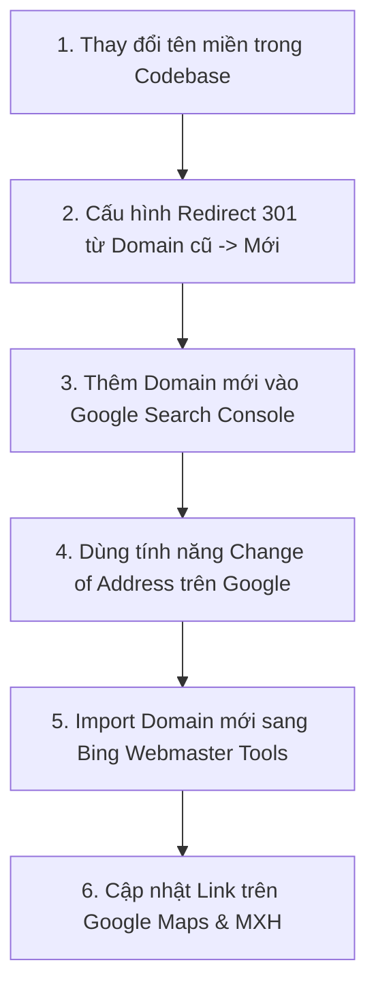

# Hướng Dẫn Cấu Hình SEO & Chuyển Đổi Domain (Domain Migration Guide)

Tài liệu này hướng dẫn chi tiết các bước cần thực hiện trong **Codebase** và trên các **Công cụ tìm kiếm (Google, Bing)** khi bạn quyết định **thay đổi tên miền (Domain)** cho trang web **Vật Tư Điện Lạnh Đông Kha**.

---

## 📋 Danh Sách Các Bước Cần Thực Hiện



---

## 🛠️ Bước 1: Thay Đổi Tên Miền Trong Codebase (Next.js)

### 1. Cập nhật `src/lib/site.ts`
Mở file [`src/lib/site.ts`](file:///e:/PROJECT/PERSONAL%20PROJECT/QC/src/lib/site.ts) và thay đổi hằng số `SITE_URL` thành tên miền mới:

```typescript
// Sửa tên miền cũ thành tên miền mới (ví dụ: https://vattudienlanhdongkha.com)
export const SITE_URL = "https://vattudienlanhdongkha.com";
```

> ⚠️ **Lưu ý:** Không để dấu gạch chéo `/` ở cuối URL.

### 2. Cập nhật Mã Xác Minh Tìm Kiếm (Nếu có mã mới)
Mở file [`src/app/layout.tsx`](file:///e:/PROJECT/PERSONAL%20PROJECT/QC/src/app/layout.tsx) và cập nhật mã xác minh của Google/Bing nếu tạo Property mới:

```typescript
verification: {
  google: "MÃ_XÁC_MINH_GOOGLE_MỚI",
  other: {
    "msvalidate.01": "MÃ_XÁC_MINH_BING_MỚI",
  },
},
```

### 3. Deploy lại Website
Thực hiện Commit & Deploy phiên bản mới lên Vercel / Server:
```bash
git add .
git commit -m "chore: update SITE_URL to new domain"
git push origin main
```

---

## 🔀 Bước 2: Cấu Hình Chuyển Hướng 301 (301 Permanent Redirect)

> 💡 **Tầm quan trọng:** Chuyển hướng 301 giúp chuyển toàn bộ thứ hạng SEO, uy tín và lượng truy cập từ tên miền cũ sang tên miền mới mà **không bị mất TOP trên Google/Bing**.

### Nếu dùng Vercel:
Vào dự án tên miền cũ trên Vercel -> **Settings** -> **Domains** -> Chọn Domain cũ -> Cấu hình **Redirect to** tên miền mới.

### Nếu dùng Cloudflare / Nginx:
Cấu hình Rule chuyển hướng vĩnh viễn (301):
```text
https://domain-cu.com/*  ===> 301 Redirect ===>  https://domain-moi.com/$1
```

---

## 🔍 Bước 3: Cấu Hình Tràn Tên Miền Trên Google Search Console

1. Truy cập [Google Search Console](https://search.google.com/search-console).
2. Thêm Property mới với tên miền mới: `https://domain-moi.com`.
3. Xác minh chủ sở hữu (bằng DNS TXT hoặc thẻ Meta HTML trong `layout.tsx`).
4. Gửi file Sitemap của tên miền mới:
   - Mục **Sitemaps** -> Nhập `https://domain-moi.com/sitemap.xml` -> Bấm **Gửi (Submit)**.
5. **Dùng tính năng Chuyển Đổi Địa Chỉ (Change of Address):**
   - Chọn Property của **Domain cũ**.
   - Vào **Cài đặt (Settings)** -> Chọn **Chuyển đổi địa chỉ (Change of address)**.
   - Chọn Domain mới -> Bấm **Xác nhận & Gửi**.

---

## 🟦 Bước 4: Cấu Hình Trên Bing Webmaster Tools (Microsoft Edge)

1. Truy cập [Bing Webmaster Tools](https://www.bing.com/webmasters/).
2. Bấm **Thêm trang web** -> Chọn **Import từ Google Search Console** (Bing sẽ tự động đồng bộ Domain mới từ Google sang).
3. Vào mục **Sitemaps** -> Gửi `https://domain-moi.com/sitemap.xml`.
4. Chọn mục **Site Move** (Di chuyển trang web) -> Thông báo chuyển từ Domain cũ sang Domain mới.

---

## 📍 Bước 5: Cập Nhật Google Maps & Mạng Xã Hội

1. **Google Doanh Nghiệp (Google Maps):**
   - Đăng nhập trang quản trị Google Maps.
   - Sửa trường **Trang web (Website)** thành URL tên miền mới.
2. **Mạng xã hội:**
   - Cập nhật liên kết Website trên Fanpage Facebook, Zalo OA, TikTok, YouTube.

---

## 🔄 Tóm Tắt Kiểm Tra Đã Hoàn Thành (Checklist)

- [ ] Cập nhật `SITE_URL` trong `src/lib/site.ts`
- [ ] Deploy code mới lên Hosting/Vercel
- [ ] Cấu hình Redirect 301 từ Domain cũ sang Domain mới
- [ ] Gửi Sitemap `https://domain-moi.com/sitemap.xml` lên Google Search Console
- [ ] Chạy "Change of Address" trên Google Search Console
- [ ] Gửi Sitemap lên Bing Webmaster Tools
- [ ] Cập nhật đường dẫn trên Google Business Profile (Google Maps)
