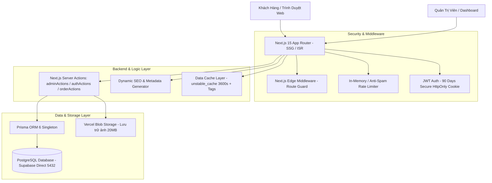

# Kiến Trúc Hệ Thống (System Architecture Document)
## Dự Án Website Vật Tư Điện Lạnh Đông Kha (`QC`)

Dự án **Vật Tư Điện Lạnh Đông Kha** là ứng dụng Web Thương Mại & Quản Lý Phụ Tùng Điện Lạnh hiện đại, tối ưu hóa tốc độ tải trang cao (SSG / On-Demand ISR), chuẩn SEO Google/Bing, tích hợp Cổng Quản Trị Đơn Hàng & In Phiếu Giao Hàng Chuyên Nghiệp.

---

## 🏗️ 1. Tổng Quan Kiến Trúc Nền Tảng (Tech Stack)



### Công Nghệ Cốt Lõi:
- **Framework Frontend & Backend**: [Next.js 15 (App Router)](https://nextjs.org/) + React 19 + TypeScript
- **Database & ORM**: PostgreSQL ([Supabase](https://supabase.com/)) + [Prisma ORM 6](https://www.prisma.io/)
- **Styling & UI**: Tailwind CSS 4 + Lucide React Icons
- **Image Storage**: `@vercel/blob` (Lưu trữ ảnh tải lên từ Admin lên đến 20MB)
- **Authentication**: JWT HS256 (`jose`) + HttpOnly Secure Cookie (90 ngày) + Google Identity Services (GIS OAuth 2.0)
- **Xuất dữ liệu & In ấn**: jsPDF + html2canvas + ExcelJS

---

## 📁 2. Cấu Trúc Thư Mục Dự Án (Directory Structure)

```text
QC/
├── docs/                             # Tài liệu kỹ thuật & kiến trúc hệ thống
│   ├── SYSTEM_ARCHITECTURE.md        # Tài liệu kiến trúc hệ thống (File này)
│   └── DOMAIN_SEO_GUIDE.md           # Hướng dẫn SEO & chuyển đổi tên miền
├── prisma/
│   └── schema.prisma                 # Định nghĩa Database Schema (PostgreSQL + binaryTargets)
├── public/                           # Tài nguyên tĩnh public (Logo, Ảnh cửa hàng, Favicon)
├── src/
│   ├── actions/                      # Server Actions (Backend Logic)
│   │   ├── adminActions.ts           # CRUD Sản phẩm, Danh mục, Dịch vụ, Gallery, Cài đặt
│   │   ├── authActions.ts            # Đăng ký, Đăng nhập Email/Mật khẩu, Đăng nhập Google
│   │   └── orderActions.ts           # Tạo đơn, Tra cứu đơn, Admin đổi trạng thái đơn
│   ├── app/                          # Next.js App Router Routes & Generators
│   │   ├── (site)/                   # Storefront công khai cho khách hàng
│   │   │   ├── page.tsx              # Trang chủ (Hero, Danh mục, Sản phẩm, Bản đồ, Liên hệ)
│   │   │   ├── san-pham/             # Danh mục sản phẩm & Chi tiết sản phẩm [slug]
│   │   │   ├── [slug]/               # Landing Page Danh Mục & SEO Địa Phương
│   │   │   ├── gio-hang/             # Giỏ hàng mua sắm
│   │   │   ├── thanh-toan/           # Trang đặt hàng & Thanh toán
│   │   │   ├── don-hang/[orderCode]/ # Trang chi tiết & tra cứu đơn hàng công khai
│   │   │   └── tai-khoan/            # Cổng tài khoản cá nhân & Lịch sử đơn hàng
│   │   ├── admin/                    # Dashboard Quản Trị Cửa Hàng
│   │   │   ├── login/                # Trang đăng nhập admin
│   │   │   └── (dashboard)/          # Quản lý Đơn hàng, Sản phẩm, Dịch vụ, Thư viện ảnh
│   │   ├── api/                      # REST API endpoints (e.g., /api/address, /api/og)
│   │   ├── apple-icon.tsx            # Tự động tạo Apple Touch Icon (180x180px PNG)
│   │   ├── icon.tsx                  # Tự động tạo Favicon chuẩn Google (96x96px PNG)
│   │   ├── layout.tsx                # Root Layout, Global Metadata & JSON-LD Schema
│   │   ├── manifest.ts               # Tự động tạo Web App Manifest (/manifest.webmanifest)
│   │   ├── robots.ts                 # Tự động tạo robots.txt
│   │   └── sitemap.ts                # Tự động tạo sitemap.xml động theo sản phẩm
│   ├── components/                   # Components giao diện reusable theo Module
│   │   ├── account/                  # Hồ sơ & Cài đặt thông tin cá nhân
│   │   ├── admin/                    # Bảng quản trị & In phiếu đơn hàng PrintableOrderSlip
│   │   ├── auth/                     # Form Đăng nhập/Đăng ký & Google One-Tap Modal
│   │   ├── cart/                     # Modal giỏ hàng & Nút thêm nhanh
│   │   ├── common/                   # Breadcrumb, Pagination, Toast
│   │   ├── contact/                  # Form liên hệ & Bản đồ
│   │   ├── home/                     # Hero, BrandSlider, Services, WhyChooseUs, Gallery, Location
│   │   ├── layout/                   # Header, Footer, FloatingContact, MobileBottomBar
│   │   ├── order/                    # Lịch sử đơn hàng & Trạng thái đơn hàng
│   │   └── product/                  # Danh mục sản phẩm, Thẻ sản phẩm, Tính BTU
│   ├── context/                      # React Context State (AuthContext, CartContext)
│   ├── data/
│   │   └── company.ts                # Dữ liệu mặc định dự phòng (Fallback Data)
│   ├── lib/
│   │   ├── auth.ts                   # Quản lý JWT Session & Cookie bảo mật
│   │   ├── cachedData.ts             # Tầng lưu đệm dữ liệu (unstable_cache + ISR Tags)
│   │   ├── company.ts                # Helper lấy thông tin cửa hàng từ DB hoặc Fallback
│   │   ├── format.ts                 # Định dạng tiền tệ VND & Ngày tháng
│   │   ├── prisma.ts                 # Singleton Prisma Client Instance
│   │   ├── rateLimit.ts              # Cơ chế chống spam & Rate limiting
│   │   └── site.ts                   # Cấu hình hằng số SITE_URL
│   ├── middleware.ts                 # Edge Route Guard bảo vệ /admin và /tai-khoan
│   └── types/                        # Khai báo kiểu TypeScript (Order, Auth, Product)
├── next.config.js                    # Cấu hình Next.js (serverExternalPackages, Blob patterns)
├── package.json                      # Quản lý thư viện phụ thuộc & Build scripts
└── tsconfig.json                     # Cấu hình TypeScript
```

---

## 🗄️ 3. Mô Hình Dữ Liệu Cơ Sở Dữ Liệu (Database Schema)

Hệ thống sử dụng **Prisma ORM** kết nối với cơ sở dữ liệu **PostgreSQL (Supabase)**:

```mermaid
erdiagram
    User ||--o{ Order : "đặt"
    Order ||--o{ OrderItem : "chứa"
    Category ||--o{ Product : "phân loại"
    Product ||--o{ ProductVariant : "có"

    User {
        string id PK
        string email UK
        string passwordHash
        string name
        string phone
        string address
        string role "ADMIN | CUSTOMER"
        string avatar
        string googleId
        datetime createdAt
        datetime updatedAt
    }

    Order {
        string id PK
        string orderCode UK "Mã DK-XXX"
        string userId FK
        string customerName
        string customerPhone
        string address
        string shippingMethod "DELIVERY | STORE_PICKUP"
        string status "PENDING | CONFIRMED | SHIPPING | COMPLETED | CANCELLED"
        int totalAmount
        string note
        datetime createdAt
        datetime updatedAt
    }

    OrderItem {
        string id PK
        string orderId FK
        string productId
        string productName
        string productImage
        string variantLabel
        int price
        int quantity
        int subtotal
    }

    Category {
        string id PK
        string name
        string slug UK
        string seoH1
        string seoTitle
        string seoDesc
        string seoContent
        string[] features
        datetime createdAt
        datetime updatedAt
    }

    Product {
        string id PK
        string name
        string slug UK
        string categoryId FK
        int price
        string image
        string[] images
        string shortDesc
        string description
        boolean active
        datetime createdAt
        datetime updatedAt
    }

    ProductVariant {
        string id PK
        string productId FK
        string label
        int price
        int sortOrder
    }

    Service {
        string id PK
        string name
        string description
        string icon
        int sortOrder
        datetime createdAt
        datetime updatedAt
    }

    CompanyInfo {
        string id PK
        string name
        string fullName
        string shortName
        string brandName
        string tagline
        string city
        string address
        string hotline
        string hotlineRaw
        string email
        string taxCode
        string zaloUrl
        string whatsAppUrl
        string facebookUrl
        string googleMapsUrl
        string googleMapsEmbed
        string workingHours
        boolean hasDelivery
        string logoUrl
        string image
        string[] images
    }

    GalleryImage {
        string id PK
        string url
        string title
        int sortOrder
        datetime createdAt
    }
```

---

## ⚡ 4. Tối Ưu Hiệu Năng & Khả Năng Mở Rộng (Performance & Scalability)

1. **Static Site Generation (SSG & ISR)**:
   - Các trang sản phẩm ([`/san-pham/[slug]`](file:///e:/PROJECT/PERSONAL%20PROJECT/QC/src/app/%28site%29/san-pham/%5Bslug%5D/page.tsx)) và danh mục ([`/[slug]`](file:///e:/PROJECT/PERSONAL%20PROJECT/QC/src/app/%28site%29/%5Bslug%5D/page.tsx)) được biên dịch sẵn thành **57+ trang HTML tĩnh** tại build time qua `generateStaticParams()`.
   - Thời gian phản hồi cho khách hàng chỉ mất **10–25ms**, đọc thẳng từ CDN / RAM mà không query Database.
2. **On-Demand Cache Revalidation**:
   - Dữ liệu được lưu trong bộ nhớ đệm `unstable_cache` với thời gian `revalidate: 3600s`.
   - Mỗi khi Quản trị viên thêm/sửa/xóa sản phẩm, Server Action tự động gọi `revalidateTag("products")` / `revalidateTag("categories")` để làm mới cache tức thì mà không cần rebuild web.
3. **Lazy Loading & Code Splitting (`next/dynamic`)**:
   - Tách rời các thư viện nặng (công cụ tính BTU, trình in phiếu `PrintableOrderSlip`) thành các chunk riêng với `ssr: false`, chỉ tải khi người dùng tương tác.
4. **Tối ưu Điều Hướng (Instant Prefetching)**:
   - Thẻ sản phẩm `ProductCard` và các liên kết `Breadcrumb` được thiết lập `<Link prefetch={true}>`, loại bỏ hoàn toàn hiện tượng nhảy màn hình khi quay lại danh sách sản phẩm.

---

## 🔒 5. Bảo Mật & Quản Trị Hệ Thống (Security & Architecture Rules)

1. **Bảo Vệ Đăng Nhập & Phân Quyền (RBAC)**:
   - Phiên đăng nhập được quản lý bằng JWT lưu trong **HttpOnly, Secure Cookie** có thời hạn 90 ngày (ngăn chặn tấn công XSS đánh cắp phiên).
   - `src/middleware.ts` kiểm soát nghiêm ngặt các tuyến đường `/admin/*` và `/tai-khoan/*`.
2. **Chống Brute-Force & Spam Đơn Hàng**:
   - Áp dụng Rate Limiting: Giới hạn tối đa 5 đơn hàng/phút/SĐT và 5 lần thử mật khẩu/5 phút.
3. **Cấu Hình Serverless Vercel**:
   - Khai báo `serverExternalPackages: ["@prisma/client", "bcryptjs"]` trong `next.config.js`.
   - Khai báo `binaryTargets = ["native", "rhel-openssl-3.0.x"]` trong `prisma/schema.prisma` để đảm bảo Query Engine của Prisma chạy ổn định trên môi trường Linux Vercel.
4. **An Toàn Dữ Liệu & Kháng Lỗi (Zero-Crash Fallback)**:
   - Toàn bộ các truy vấn tĩnh khi xuất bản đều được bọc trong khối `try...catch` kèm theo dữ liệu fallback dự phòng, bảo đảm website không bao giờ bị sập do nghẽn mạng Database.
