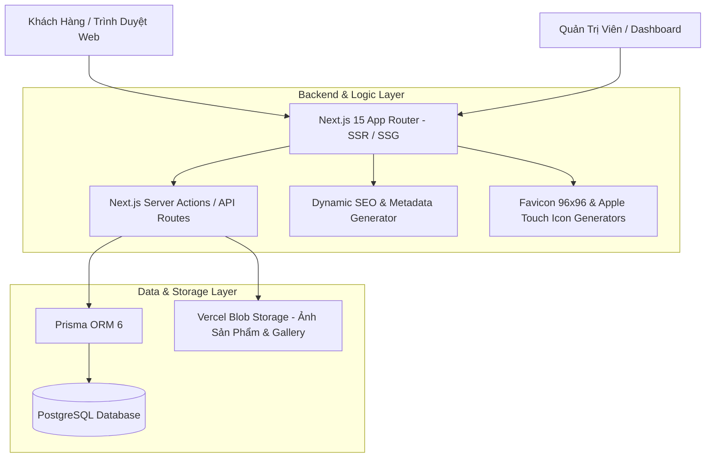

# Kiết Trúc Hệ Thống (System Architecture Document)
## Dự Án Website Vật Tư Điện Lạnh Đông Kha (`QC`)

Dự án **Vật Tư Điện Lạnh Đông Kha** là một ứng dụng Web Thương Mại & Giới Thiệu Sản Phẩm hiện đại, tối ưu hóa tốc độ cao, chuẩn SEO Google/Bing và sẵn sàng cho các thiết bị di động (PWA/Add to Home Screen).

---

## 🏗️ 1. Tổng Quan Kiến Trúc Nền Tảng (Tech Stack)



### Công Nghệ Cốt Lõi:
- **Framework Frontend & Backend**: [Next.js 15 (App Router)](https://nextjs.org/) + React 19 + TypeScript
- **Database & ORM**: PostgreSQL + [Prisma ORM 6](https://www.prisma.io/)
- **Styling & UI**: Tailwind CSS 4 + Lucide React Icons
- **Image Storage**: `@vercel/blob` (Lưu trữ ảnh tải lên từ Admin)
- **Linter & Optimization**: Oxlint + Next/OG Image Generation

---

## 📁 2. Cấu Trúc Thư Mục Dự Án (Directory Structure)

```text
QC/
├── docs/                             # Tài liệu kỹ thuật & kiến trúc hệ thống
│   ├── SYSTEM_ARCHITECTURE.md        # Tài liệu kiến trúc hệ thống (File này)
│   └── DOMAIN_SEO_GUIDE.md           # Hướng dẫn SEO & chuyển đổi tên miền
├── prisma/
│   └── schema.prisma                 # Định nghĩa Database Schema (PostgreSQL)
├── public/                           # Tài nguyên tĩnh public (Logo, Ảnh cửa hàng)
│   └── images/
│       ├── logo.png                  # Logo chính thức cửa hàng
│       └── storefront.png            # Ảnh mặt tiền cửa hàng
├── src/
│   ├── app/                          # Next.js App Router Routes & Generators
│   │   ├── (site)/                   # Storefront công khai cho khách hàng
│   │   │   ├── page.tsx              # Trang chủ (Hero, Danh mục, Sản phẩm, Bản đồ, Liên hệ)
│   │   │   └── san-pham/             # Trang danh mục & chi tiết sản phẩm
│   │   ├── admin/                    # Dashboard Quản Trị Cửa Hàng
│   │   │   ├── login/                # Trang đăng nhập admin
│   │   │   └── (dashboard)/          # Quản lý Sản phẩm, Thông tin cửa hàng, Thư viện ảnh
│   │   ├── api/                      # REST API endpoints (e.g., /api/gallery)
│   │   ├── apple-icon.tsx            # Tự động tạo Apple Touch Icon (180x180px PNG)
│   │   ├── icon.tsx                  # Tự động tạo Favicon chuẩn Google (96x96px PNG)
│   │   ├── layout.tsx                # Root Layout, Global Metadata & JSON-LD Schema
│   │   ├── manifest.ts               # Tự động tạo Web App Manifest (/manifest.webmanifest)
│   │   ├── robots.ts                 # Tự động tạo robots.txt
│   │   └── sitemap.ts                # Tự động tạo sitemap.xml động theo sản phẩm
│   ├── components/                   # Components giao diện reusable
│   │   ├── AllProductsCatalog.tsx    # Giao diện danh mục tất cả sản phẩm
│   │   ├── BTUCalculatorModal.tsx    # Modal công cụ tính công suất điều hòa (BTU)
│   │   ├── FloatingContact.tsx       # Thanh liên hệ nhanh cố định (Hotline, Zalo, Maps)
│   │   ├── Header.tsx / Footer.tsx   # Đầu & Chân trang
│   │   └── admin/                    # Components giao diện quản trị
│   ├── data/
│   │   └── company.ts                # Dữ liệu mặc định dự phòng (Fallback Data)
│   ├── lib/
│   │   ├── company.ts                # Helper lấy thông tin cửa hàng từ DB hoặc Fallback
│   │   ├── prisma.ts                 # Singleton Prisma Client Instance
│   │   └── site.ts                   # Cấu hình hằng số SITE_URL
│   └── utils/                        # Các hàm tiện ích
├── next.config.js                    # Cấu hình Next.js (Body size limit 20MB, Images pattern)
├── package.json                      # Quản lý thư viện phụ thuộc
└── tsconfig.json                     # Cấu hình TypeScript
```

---

## 🗄️ 3. Mô Hình Dữ Liệu Cơ Sở Dữ Liệu (Database Schema)

Hệ thống sử dụng **Prisma ORM** kết nối với cơ sở dữ liệu **PostgreSQL**:

```mermaid
erdiagram
    Category ||--o{ Product : "chứa"
    Product ||--o{ ProductVariant : "có"

    Category {
        string id PK
        string name
        string slug UK
        datetime createdAt
        datetime updatedAt
    }

    Product {
        string id PK
        string name
        string slug UK
        string categoryId FK
        float price
        string unit
        string image
        string[] images
        string shortDesc
        string description
        boolean active
        datetime createdAt
        datetime updatedAt
    }

    ProductVariant {
        string id PK
        string productId FK
        string name
        float price
        int sortOrder
    }

    CompanyInfo {
        string id PK
        string name
        string address
        string hotline
        string hotlineRaw
        string zaloUrl
        string whatsAppUrl
        string facebookUrl
        string googleMapsUrl
        string googleMapsEmbed
        string workingHours
        string image
        string[] images
    }

    GalleryImage {
        string id PK
        string url
        string title
        int sortOrder
        datetime createdAt
    }
```

---

## 🚀 4. Điểm Nổi Bật Về Kiến Trúc & Hiệu Năng (Key Features)

### A. Tối Ưu Hóa SEO & Lập Chỉ Mục (Google & Bing)
1. **Dynamic Metadata & OpenGraph**: Mọi trang (Trang chủ, Danh mục, Sản phẩm) đều có Metadata được tạo động qua `generateMetadata()`.
2. **Dữ Liệu Cấu Trúc JSON-LD (`schema.org`)**:
   - Khai báo loại hình doanh nghiệp: `["HVACBusiness", "Store", "LocalBusiness"]`.
   - Khai báo thông tin chi tiết địa lý (`geo`), khu vực phục vụ (`areaServed`: Đà Nẵng), tiền tệ (`VND`).
   - Khai báo cấu trúc sản phẩm `Product` và thương hiệu `Brand` chi tiết.
3. **Favicon & Apple Icon Chuẩn**:
   - Sử dụng `ImageResponse` từ `next/og` tạo favicon `96x96`px (đạt chuẩn bội số 48px của Google) và Apple Icon `180x180`px.
4. **Sitemap & Robots Tự Động**: `/sitemap.xml` và `/robots.txt` tự động cập nhật mỗi khi có sản phẩm mới.

### B. Luồng Xử Lý Dữ Liệu & Server Actions
- **Tải Ảnh Dung Lượng Lớn**: `next.config.js` mở rộng `bodySizeLimit: "20mb"` hỗ trợ chụp ảnh trực tiếp từ điện thoại tải lên Vercel Blob Storage.
- **Server Actions (`src/app/admin/actions.ts`)**: Xử lý các thao tác Thêm/Sửa/Xóa sản phẩm, cập nhật thông tin cửa hàng an toàn trực tiếp trên Server không qua API trung gian.

### C. Trải Nghiệm Người Dùng (Mobile-First UX)
- **Thanh Liên Hệ Nhanh (`FloatingContact.tsx`)**: Giúp khách hàng và thợ điện lạnh bấm gọi Hotline, nhắn Zalo hoặc mở chỉ đường Google Maps chỉ với 1 chạm.
- **Công Cụ Tính Công Suất Điều Hòa (BTU Calculator)**: Tính toán diện tích/thể tích phòng để gợi ý công suất máy lạnh phù hợp cho khách hàng.
- **Khả Năng Thêm Vào Màn Hình Chính (PWA / Add to Home Screen)**: Được cấu hình đầy đủ Web App Manifest (`manifest.ts`).

---

## 🔒 5. Bảo Mật & Bảo Trì System
1. **Quản Lý Biến Môi Trường (`.env`)**:
   - Lưu trữ chuỗi kết nối Database `DATABASE_URL` và Token Vercel Blob `BLOB_READ_WRITE_TOKEN`.
2. **Kiểm Lỗi Mã Nguồn**:
   - Chạy `npx oxlint` hoặc `npm run lint` để kiểm tra toàn bộ mã nguồn trước khi deploy sản phẩm.
